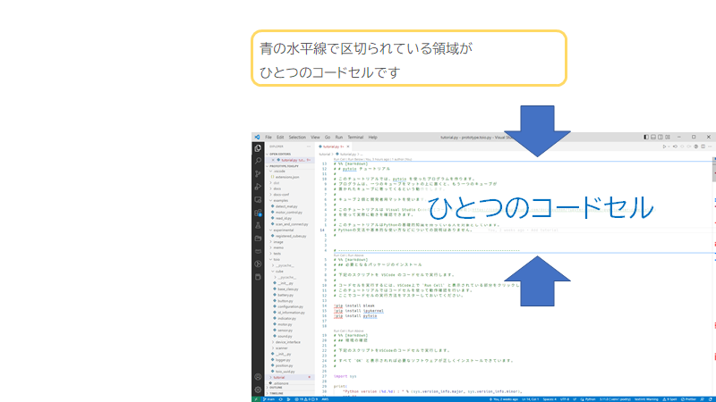
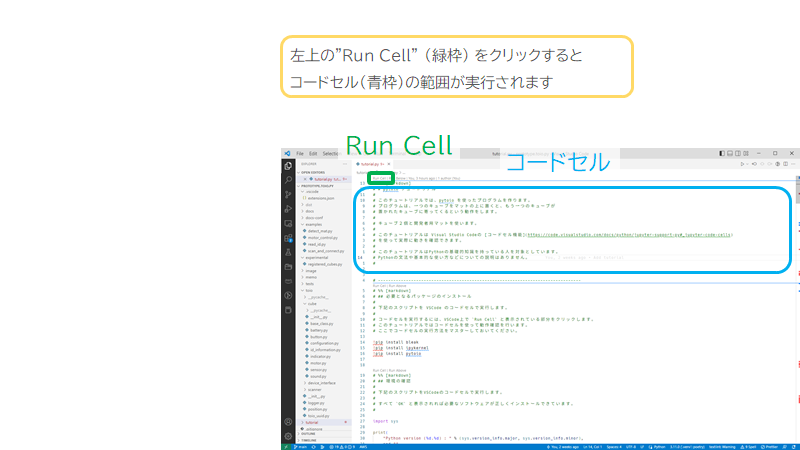
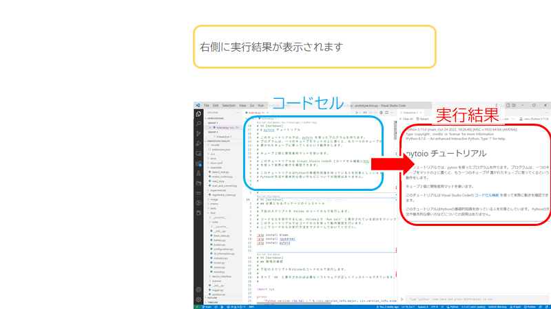
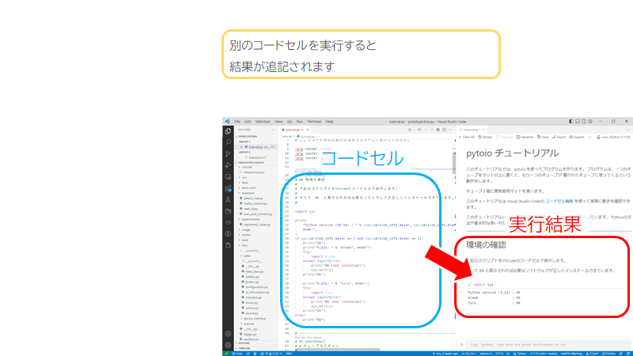

# toio.py セットアップガイド

これは toio.py のセットアップガイドです。
toio.py は Python から[toio コアキューブ](https://toio.io/platform/cube/)を制御するためのライブラリです。

## 動作確認環境

### 主な確認環境

- Windows: Windows10 (22H2)

### 補助的な確認環境

- Windows: Windows11 (23H2)
- Linux: Ubuntu24.04
- macOS: macOS 14(Sonoma)

### 実験的な実装

- iOS, iPadOS: 17

## インストール（Windows）

## [Python](https://www.python.org/) のインストール（Version 3.11 以降推奨）

### Python 本体のインストール

[Python Japan の Windows 版 Python のインストール](https://www.python.jp/install/windows/install.html)を参考にして Python をインストールします。
3.11 以降のバージョンを推奨します。

### 関連パッケージのインストール

コマンドプロンプトを開きます。

下記のコマンドを入力し、Python パッケージをインストールします。

#### setuptools

setuptoolsを最新版にします。

```
python -m pip install setuptools --upgrade
```

#### typing-extensions

```
python -m pip install typing-extensions
```

#### bleak

```
python -m pip install bleak
```

#### toio.py

```
python -m pip install toio-py --upgrade
```

#### ipykernel

```
python -m pip install ipykernel
```


**確認**

コマンドプロンプトで下記コマンドを実行します。

```
python -c "import toio.scanner; print('ok')"
```

`ok` と表示が出れば toio.py のインストールは成功です。

ImportError が出る場合はうまくインストールできていません。
再度 toio.py のインストールを実行してもうまくいかない場合は
Python の再インストールを試みてください。

**参考：ImportError のメッセージ**

このメッセージが出る場合は失敗です。

```
Traceback (most recent call last):
  File "<string>", line 1, in <module>
ModuleNotFoundError: No module named 'toio.scanner'
```

## [Visual Studio Code](https://code.visualstudio.com/) のインストール

[Python Japan のページにある Visual Studio Code のインストール](https://www.python.jp/python_vscode/windows/setup/install_vscode.html)を参考にして、Visual Studio Code と Python 機能拡張をインストールします。

Python 機能拡張を入れた後は、Jupyter 機能拡張をインストールします。

Python 機能拡張のインストールと同様の手順で、 `Jupyter` と検索します。

下記の Microsoft 製の Jupyter 機能拡張をインストールします。


## チュートリアルの実行

[toio.py のチュートリアル tutorial.ja.py](https://github.com/toio/toio.py/releases/latest/download/tutorial.ja.py)
をダウンロードし、Visual Studio Code でチュートリアルを開きます

チュートリアルは Visual Studio Code の [コードセル機能](https://code.visualstudio.com/docs/python/jupyter-support-py#_jupyter-code-cell)を使って、実際にコードを実行しながら読み進められるようになっています。

### Visual Studio Code のコードセル機能

Visual Studio Code には、ドキュメントに書かれている部分的な Python コードを個別に実行する機能（コードセル実行機能）があります。

tutorial.py を開くと、下記画面のようにテキストがいくつかの青色の水平線で区切られた状態で表示されます。

青線で区切られた部分がひとつのコードセルです。



左上にある `Run Cell` の文字をクリックすると、ひとつのコードセルが実行されます。



`Run Cell` 部分を拡大したもの


**補足情報：`Run Cell` が表示されないときは**

Visual Studio Code が Restricted Mode で動作している場合にはコードセル機能は使えません。Visual Studio Code のウィンドウ左下に Restricted Mode の表示が出ている場合には、Restricted Mode の文字をクリックし、Trusted Window に設定してください。

**Restricted Mode 表示**


**Trusted Window 設定画面**


コードセルの実行結果は右側に表示されます。



他のコードセルを実行すると、そのコードセルの実行結果が追加されます。



---

# API ドキュメント

自動生成したドキュメントは[こちら](https://toio.github.io/toio.py/)
