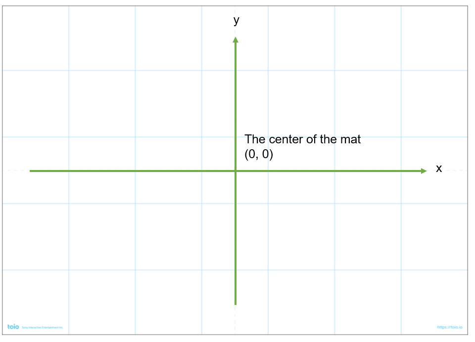
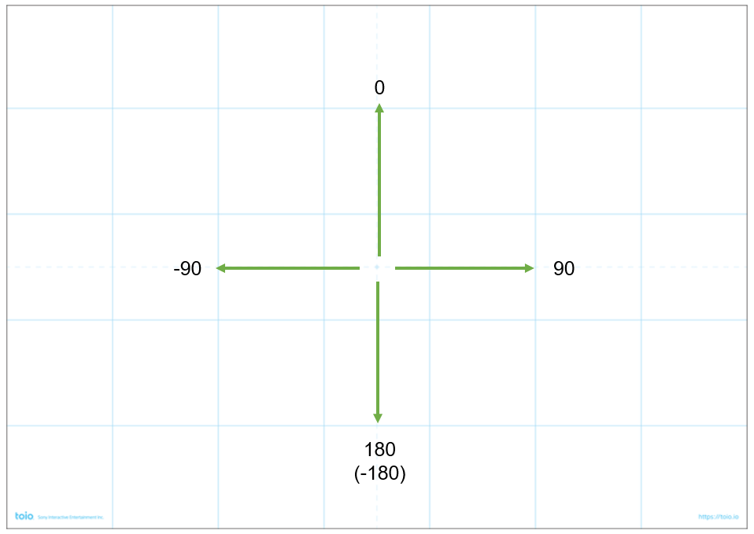

# SimpleCube API

API for easy access to the toio Core Cube

- Simple
- No asynchronous processing
- No cube scanning required
- Functions with almost the same functionality as Visual Programming blocks

---

## Example

### Motor control

```Python
import sys

from toio.simple import SimpleCube


def test():
    with SimpleCube() as cube:
        cube.move(30, 3)
        cube.spin(60, 2)
        cube.run_motor(70, 10, 1)
        cube.run_motor(10, 70, 1)
        cube.run_motor(-20, -20, 0)
        cube.sleep(0.5)
        cube.stop_motor()

if __name__ == "__main__":
    sys.exit(test())
```

### Motor control (Move to the specified position)

```Python
import sys

from toio.simple import SimpleCube


def test():
    targets = ((30, 30), (30, -30), (-30, -30), (-30, 30), (30, 30))
    with SimpleCube() as cube:
        for target in targets:
            target_pos_x, target_pos_y = target
            print(f"move to ({target_pos_x}, {target_pos_y})")
            success = cube.move_to(speed=70, x=target_pos_x, y=target_pos_y)
            print(f"arrival: {success}")
            if not success:
                print("Position ID missed")
                break
            cube.sleep(0.5)


if __name__ == "__main__":
    sys.exit(test())
```

### Location reading

```Python
import signal
import sys

from toio.simple import SimpleCube

LOOP = True


def ctrl_c_handler(_signum, _frame):
    global LOOP
    print("Ctrl-C")
    LOOP = False


signal.signal(signal.SIGINT, ctrl_c_handler)


def test():
    with SimpleCube() as cube:
        while LOOP:
            pos = cube.get_current_position()
            orientation = cube.get_orientation()
            print("POSITION:", pos, orientation)
            cube.sleep(0.5)


if __name__ == "__main__":
    sys.exit(test())
```

### Other sample code

Additional sample code can be found in the examples-simple directory.

---

## API List

```Python
    # connect and disconnect
    SimpleCube(name: Optional[str] = None, timeout:int = 5, log_level: int = NOTSET) -> None:
    disconnect():

    # Motor control and movement
    move(speed: int, duration: float) -> None:
    spin(speed: int, duration: float) -> None:
    run_motor(left_speed: int, right_speed: int, duration: float,) -> None:
    stop_motor() -> None:
    move_steps(direction: Direction, speed: int, step: int) -> bool:
    turn(speed: int, degree: int) -> bool:
    move_to(speed: int, x: int, y: int) -> bool:
    set_orientation(speed: int, degree: int) -> bool:
    move_to_the_grid_cell(speed: int, cell_x: int, cell_y: int) -> bool:

    # Get position information
    get_current_position() -> Optional[tuple[int, int]]:
    get_x() -> Optional[int]:
    get_y() -> Optional[int]:
    get_orientation() -> Optional[int]:
    get_grid() -> Optional[tuple[int, int]]:
    get_grid_x() -> Optional[int]:
    get_grid_y() -> Optional[int]:
    is_on_the_gird_cell(cell_x: int, cell_y: int) -> bool:

    # Get card information
    is_touched(item: StandardIdType) -> bool:
    get_touched_card() -> Optional[StandardId]:

    # Get other information
    get_cube_name() -> Optional[str]:
    get_battery_level() -> Optional[int]:
    get_3d_angle() -> Optional[tuple[int, int, int]]:
    get_posture() -> Optional[int]:
    is_button_pressed() -> Optional[int]:

    # Lamp control
    turn_on_cube_lamp(r: int, g: int, b: int, duration: float) -> None:
    turn_off_cube_lamp() -> None:

    # sound control
    play_sound(note: int, duration: float) -> bool:
    stop_sound() -> None:

    # detect a magnet
    is_magnet_in_contact() -> Optional[int]:

    # wait for time
    sleep(sleep_second: float):

```

---

## API description

### Connect and disconnect

#### `SimpleCube(name: Optional[str] = None, timeout:int = 5, log_level: int = NOTSET) -> None:`

Create a `SimpleCube` object.
When you create a `SimpleCube` instance, the cube is searched for and connected.

| Arguments | Description                              |
| --------- | ---------------------------------------- |
| name      | unique 3-digit ID of the cube to connect |
| timeout   | scan timeout in seconds                  |
| log_level | log level                                |

##### Examples of use

This sample code performs the following actions.

- Connect to a nearby cube
- Advance the Cube at speed 50 for 1 second
- Disconnect

```Python
cube = SimpleCube()
cube.move(50, 1)
cube.disconnect()
```

`SimpleCube()` can use `with` statements because it is a context manager.
When exiting the `with` block, `disconnect()` is automatically called.
The preceding code can be written as follows by using the `with` statement.

```Python
with SimpleCube() as cube:
  cube.move(50, 1)
```

If `disconnect()` is not called and the program exits while still connected to the Cube,
it may not be possible to connect in subsequent program executions.
To ensure a reliable disconnect, it is recommended to use `SimpleCube()` with the `with` statement.

##### Cubes to be connected

If `SimpleCube()` does not have the argument `name`, `SimpleCube()` looks for a surrounding cube and tries to connect to the cube with the best signal reach.
If no cube is found in the vicinity, a `ValueError` exception is thrown.

If the argument `name` is a string with a unique 3-digit ID, it tries to connect to the specified cube.
If the given cube is not found, a `ValueError` exception is thrown.

##### Special note on Windows

Windows can register cubes with the OS as Bluetooth devices.  
The registered cube has priority as the connection target.

When running on Windows, the target cube for connection is determined in the following order.

**Connection order in Window: with `name` specified**.

1. a cube registered in the OS with a matching `name`
2. if not found, the cube that was actually scanned and the `name` matches

**Connection order in Window: without `name` specified**.

1. the cube registered in the OS that has the best radio reception
2. if not found, actually scan the cube with the best radio reception

#### `disconnect()`

Disconnect from the cube.

If `disconnect()` is not called and the program exits while still connected to the Cube,
it may not be possible to connect in subsequent program executions.
Make sure to disconnect at the end of the program.

### Motor control and movement

#### `move(speed: int, duration: float) -> None:`

Move the cube.

| Arguments |    Description     |       Possible values       |
| --------- | ------------------ | --------------------------- |
| speed     | motor speed        | -100 &lt;= speed &lt;= 100  |
| duration  | running time (sec) | 0 &lt;= duration &lt;= 2.55 |


A positive value for `speed` will move forward. Negative values cause backward motion.

If `duration` is set to a value greater than 2.55, it is treated as 2.55.
If `duration` is set to 0, it is "no time limit". In this case, `move()` does not wait for completion, but returns immediately after communicating with the cube.

#### `spin(speed: int, duration: float) -> None:`

Rotate the cube in place.

| Arguments |    Description     |       Possible values       |
| --------- | ------------------ | --------------------------- |
| speed     | motor speed        | -100 &lt;= speed &lt;= 100  |
| duration  | running time (sec) | 0 &lt;= duration &lt;= 2.55 |

A positive value for `speed` causes counterclockwise rotation, a negative value causes clockwise rotation.

If `duration` is set to a value greater than 2.55, it is treated as 2.55.
If `duration` is set to 0, it is "no time limit". In this case, `move()` does not wait for completion, but returns immediately after communicating with the cube.

#### `run_motor(left_speed: int, right_speed: int, duration: float,) -> None:`

The cube's motors run at separate speeds for the left and right side of the cube.

|  Arguments  |     Description     |         Possible values         |
| ----------- | ------------------- | ------------------------------- |
| left_speed  | motor speed (left)  | 100 &lt;= left_speed &lt;= 100  |
| right_speed | motor speed (right) | 100 &lt;= right_speed &lt;= 100 |
| duration    | running time (sec)  | 0 &lt;= duration &lt;= 2.55     |

Positive values for `left_speed` and `right_speed` will rotate forward, and negative values will rotate backward, respectively.

If `duration` is set to a value greater than 2.55, it is treated as 2.55.
If `duration` is set to 0, it is "no time limit". In this case, `move()` does not wait for completion, but returns immediately after communicating with the cube.

#### `stop_motor() -> None:`

Stop the motor of the cube.

#### `move_steps(direction: Direction, speed: int, step: int) -> bool:`

This function requires a mat. It will not work where there is no mat.

The cube is advanced a specified number of steps on the mat.

| Arguments |   Description   |            Possible values             |
| --------- | --------------- | -------------------------------------- |
| direction | direction       | Direction.Forward / Direction.Backward |
| speed     | motor speed     | -100 &lt;= speed &lt;= 100             |
| step      | number of steps | 0 &lt;= step                           |

#### `turn(speed: int, degree: int) -> bool:`

This function requires a mat. It will not work where there is no mat.

Rotates the cube by the relative angle specified by `degree` relative to the orientation of the cube at the time this function is called.

| Arguments |  Description   |      Possible values       |
| --------- | -------------- | -------------------------- |
| speed     | motor speed    | -100 &lt;= speed &lt;= 100 |
| degree    | relative angle |                            |

#### `move_to(speed: int, x: int, y: int) -> bool:`

This function requires a mat. It will not work where there is no mat.

Moves the cube to the specified coordinates.

| Arguments |     Description     |      Possible values       |
| --------- | ------------------- | -------------------------- |
| speed     | motor speed         | -100 &lt;= speed &lt;= 100 |
| x         | target position (x) |                            |
| y         | target position (y) |                            |

#### `set_orientation(speed: int, degree: int) -> bool:`

This function requires a mat. It will not work where there is no mat.

Orient the cube to the specified orientation on a mat.

| Arguments | Description |      Possible values       |
| --------- | ----------- | -------------------------- |
| speed     | motor speed | -100 &lt;= speed &lt;= 100 |
| degree    | orientation |                            |

#### `move_to_the_grid_cell(speed: int, cell_x: int, cell_y: int) -> bool:`

This function requires a mat. It will not work where there is no mat.

Moves the cube to the specified grid cell position.

| Arguments |             Description             |      Possible values       |
| --------- | ----------------------------------- | -------------------------- |
| speed     | motor speed                         | -100 &lt;= speed &lt;= 100 |
| cell_x    | position of the cell in the mat (x) |                            |
| cell_y    | position of the cell in the mat (y) |                            |

### Location information

#### `get_current_position() -> Optional[tuple[int, int]]:`

This function requires a mat. It will not work where there is no mat.

Returns a tuple of `(x, y)` of the coordinates where the cube is located.

Returns `None` if the cube position is not detected correctly.

#### `get_x() -> Optional[int]:`

This function requires a mat. It will not work where there is no mat.

Returns the x coordinate where the cube is located as an integer value.

Returns `None` if the cube position is not detected correctly.

#### `get_y() -> Optional[int]:`

This function requires a mat. It will not work where there is no mat.

Returns the y coordinate where the cube is located as an integer value.

Returns `None` if the cube position is not detected correctly.

#### `get_orientation() -> Optional[int]:`

This function requires a mat. It will not work where there is no mat.

Returns the orientation of the cube on a mat as an integer value.

Returns `None` if the cube position is not detected correctly.

#### `get_grid() -> Optional[tuple[int, int]]:`

This function requires a mat. It will not work where there is no mat.

Returns a tuple of `(x position, y position)` of the grid cell where the cube is located.

Returns `None` if the cube position is not detected correctly.

#### `get_grid_x() -> Optional[int]:`

This function requires a mat. It will not work where there is no mat.

Returns the x position of the grid cell where the cube is located as an integer value.

Returns `None` if the cube position is not detected correctly.

#### `get_grid_y() -> Optional[int]:`

This function requires a mat. It will not work where there is no mat.

Returns the y-position of the grid cell where the cube is located as an integer value.

Returns `None` if the cube position is not detected correctly.

#### `is_on_the_gird_cell(cell_x: int, cell_y: int) -> bool:`

This function requires a mat. It will not work where there is no mat.

Returns whether the cube is in the given gird cell location.
Returns `True` if the cube is present, or `False` if it is not present.

| Arguments | Description                         |
| --------- | ----------------------------------- |
| cell_x    | position of the cell in the mat (x) |
| cell_y    | position of the cell in the mat (y) |

### Obtain card information

#### `is_touched(item: StandardIdType) -> bool:`

| Arguments | Description | Possible values                                          |
| --------- | ----------- | -------------------------------------------------------- |
| item      | card type   | card defined in [standard_id.py](. /toio/standard_id.py) |

The following code displays `Number 0` when the cube touches the number 0 on the simple mat.

```Python
if cube.is_touched(StandardIdCard.NUMBER_0):
    print("Number 0")
```

#### `get_touched_card() -> Optional[StandardId]:`

Returns the type of card the cube is currently touching.

Returns `None` if no cards are touched.

### Obtaining other information

#### `get_cube_name() -> Optional[str]:`

Returns the name of the currently connected cube.

Returns `None` if the cube name was not obtained correctly.

#### `get_battery_level() -> Optional[int]:`

Returns the current battery level as an integer value from 0 to 100.

Returns `None` if the battery level was not obtained correctly from the cube.

#### `get_3d_angle() -> Optional[tuple[int, int, int]]:`

Returns a `(roll, pitch, yaw)` tuple of the current cube's attitude angles.

Returns `None` if the attitude angle is not correctly obtained from the cube.

For more information on attitude angles, see [toio Core Cube Specifications: Obtaining posture angle information (notifications in Euler angles)](https://toio.github.io/toio-spec/en/docs/ble_high_precision_tilt_sensor#obtaining-posture-angle-information-notifications-in-euler-angles).

#### `get_posture() -> Optional[int]:`

Returns the current cube attitude (not attitude angle) as an integer value from 1 to 6.

Returns `None` if the cube posture was not obtained correctly.

For more information on cube orientation, see [toio Core Cube Specifications: Posture detection ](https://toio.github.io/toio-spec/en/docs/ble_sensor/#posture-detection).

#### `is_button_pressed() -> Optional[int]:`

Get the current state of the cube's buttons.

The relationship between the return value and the button status is as follows

| return value | button status |
| ------------ | ------------- |
| 0            | not pressed   |
| 128          | pressed       |

Returns `None` if the button state is not obtained correctly.

### Lamp control

#### `turn_on_cube_lamp(r: int, g: int, b: int, duration: float) -> None:`

Lights the lamp.

| Arguments |       Description       |   Possible values   |
| --------- | ----------------------- | ------------------- |
| r         | red component           | 0 &lt;= r &lt;= 255 |
| g         | green component         | 0 &lt;= g &lt;= 255 |
| b         | blue component          | 0 &lt;= b &lt;= 255 |
| duration  | luminescence time (sec) | 0 or more           |

#### `turn_off_cube_lamp() -> None:`

Turn off the lamp.

### Sound Control

#### `play_sound(note: int, duration: float) -> bool:`

Sound.

| Arguments |     Description     |        Possible values         |
| --------- | ------------------- | ------------------------------ |
| note      | pitch               | 0 &lt;= note &lt;= 127         |
| duration  | sounding time (sec) | 0.01 &lt;= duration &lt;= 25.5 |

For the relationship between the number specified for `note` and the pitch, see [toio Core Cube Specifications: MIDI note number and note name](https://toio.github.io/toio-spec/en/docs/ble_sound#midi-note-number-and-note-name).

#### `stop_sound() -> None:`

Stops the sound.

### Magnet detection

#### `is_magnet_in_contact() -> Optional[int]:`

Returns the state of the magnet.

The relationship between the values and magnet positions can be found in [toio Core Cube Specifications: Magnet layout specifications](https://toio.github.io/toio-spec/en/docs/hardware_magnet/#magnet-layout-specifications).

### Waiting time

#### `sleep(sleep_second: float):`

Wait only for the specified time.

| Arguments    | Description            | Possible values |
| ------------ | ---------------------- | --------------- |
| sleep_second | Waiting time (seconds) | 0 or more       |

If I use `time.sleep()`, the Python interpreter stops entirely and communication with the cube also stops, and the program does not work properly.

Use this function to perform wait processing for cube movements, such as when a function such as `move()` is operated with "no time limit".

The following code makes the cube run at speed 50 with no time limit, waits 10 seconds, and then stops.

```Python
cube.move(50, 0)
cube.sleep(10)
cube.stop_motor()
```

## Origin and cube orientation

### Origin



### Orientation


